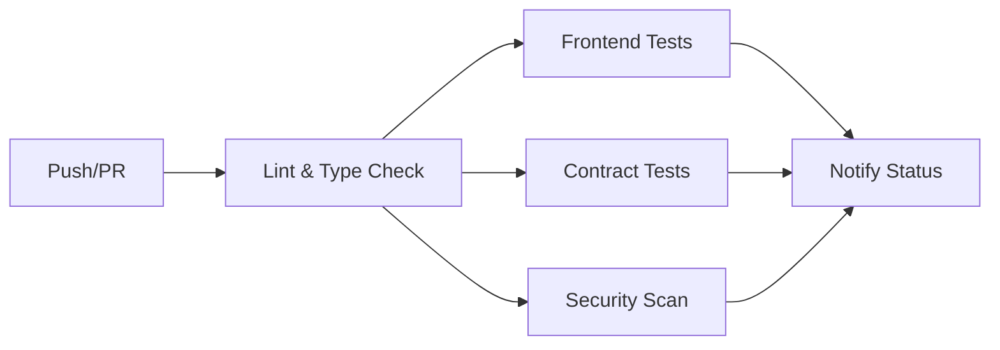

# Deployment Guide

Complete guide for deploying Kōbo NFT platform with automated CI/CD pipelines.

## Table of Contents

1. [Prerequisites](#prerequisites)
2. [Environment Setup](#environment-setup)
3. [GitHub Actions CI/CD](#github-actions-cicd)
4. [Contract Deployment](#contract-deployment)
5. [Frontend Deployment](#frontend-deployment)
6. [Monitoring & Error Tracking](#monitoring--error-tracking)
7. [Troubleshooting](#troubleshooting)

## Prerequisites

### Required Tools

- **Node.js** 18+ and **pnpm** 8+
- **Foundry** (for smart contracts)
- **Git** and **GitHub** account
- **Vercel** account (for frontend hosting)
- **Sentry** account (optional, for error tracking)

### Required API Keys

1. **WalletConnect Project ID**: [cloud.walletconnect.com](https://cloud.walletconnect.com)
2. **Pinata API Keys**: [app.pinata.cloud](https://app.pinata.cloud/developers/api-keys)
3. **Hugging Face API Key** (optional): [huggingface.co/settings/tokens](https://huggingface.co/settings/tokens)
4. **Etherscan API Key**: [etherscan.io/myapikey](https://etherscan.io/myapikey)
5. **Sentry DSN** (optional): [sentry.io](https://sentry.io/settings/projects/)
6. **Vercel Token**: [vercel.com/account/tokens](https://vercel.com/account/tokens)

## Environment Setup

### 1. Local Development

Copy the example environment file:

```bash
cp .env.example .env
```

Fill in the required values:

```bash
# Blockchain Configuration
VITE_CHAIN=sepolia

# API Keys
VITE_HF_API_KEY=your_huggingface_key
VITE_WALLETCONNECT_PROJECT_ID=your_walletconnect_id
VITE_PINATA_API_KEY=your_pinata_key
VITE_PINATA_SECRET_KEY=your_pinata_secret
VITE_PINATA_GATEWAY=https://gateway.pinata.cloud

# Sentry (optional)
VITE_SENTRY_DSN=your_sentry_dsn
VITE_APP_VERSION=1.0.0
```

### 2. GitHub Secrets

Configure the following secrets in your GitHub repository:

**Settings → Secrets and variables → Actions → New repository secret**

#### Required Secrets

```bash
# Vercel Deployment
VERCEL_TOKEN=your_vercel_token
VERCEL_ORG_ID=your_vercel_org_id
VERCEL_PROJECT_ID=your_vercel_project_id

# Smart Contract Deployment
DEPLOYER_PRIVATE_KEY=your_wallet_private_key
ETHERSCAN_API_KEY=your_etherscan_key
RPC_URL=https://sepolia.infura.io/v3/YOUR_INFURA_KEY

# Frontend Environment Variables
VITE_WALLETCONNECT_PROJECT_ID=your_walletconnect_id
VITE_HF_API_KEY=your_huggingface_key
VITE_PINATA_API_KEY=your_pinata_key
VITE_PINATA_SECRET_KEY=your_pinata_secret
VITE_PINATA_GATEWAY=https://gateway.pinata.cloud

# Sentry (optional)
VITE_SENTRY_DSN=your_sentry_dsn
SENTRY_ORG=your_sentry_org
SENTRY_PROJECT=your_sentry_project
SENTRY_AUTH_TOKEN=your_sentry_auth_token
```

#### Getting Vercel Credentials

```bash
# Install Vercel CLI
pnpm add -g vercel

# Login and link project
vercel login
vercel link

# Get org and project IDs from .vercel/project.json
cat .vercel/project.json
```

## GitHub Actions CI/CD

### Workflow Overview

The platform uses three main workflows:

1. **CI Pipeline** (`.github/workflows/ci.yml`)
   - Runs on every push and PR
   - Linting, type checking, tests
   - Security scanning
   - Contract tests and coverage

2. **Deploy Contracts** (`.github/workflows/deploy-contracts.yml`)
   - Deploys smart contracts to testnet
   - Runs on contract changes or manual trigger
   - Updates metadata and creates PR

3. **Deploy Frontend** (`.github/workflows/deploy-frontend.yml`)
   - Deploys to Vercel (preview and production)
   - Uploads source maps to Sentry
   - Creates Sentry releases

### Triggering Deployments

#### Automatic Deployment

Deployments trigger automatically on push to `main`:

```bash
git add .
git commit -m "feat: new feature"
git push origin main
```

#### Manual Deployment

Use GitHub Actions UI:

1. Go to **Actions** tab
2. Select workflow (Deploy Contracts or Deploy Frontend)
3. Click **Run workflow**
4. Choose network/environment
5. Click **Run workflow**

### CI Pipeline Stages



## Contract Deployment

### Manual Deployment

Use the deployment script:

```bash
# Set environment variables
export PRIVATE_KEY="your_private_key"
export RPC_URL="https://sepolia.infura.io/v3/YOUR_KEY"
export ETHERSCAN_API_KEY="your_etherscan_key"

# Run deployment
./scripts/deploy-contracts.sh sepolia
```

### Automated Deployment

Contracts deploy automatically when:
- Changes pushed to `contracts/` directory on `main` branch
- Manual workflow trigger via GitHub Actions

### Deployment Process

1. **Pre-deployment checks**
   - Run all contract tests
   - Verify environment variables
   - Check contract sizes

2. **Deploy contracts**
   - Deploy to specified network
   - Verify on Etherscan
   - Generate deployment artifacts

3. **Post-deployment**
   - Update `metadata.json`
   - Create PR with updated metadata
   - Report to Sentry

### Supported Networks

- **Ethereum Sepolia** (testnet)
- **Ethereum Goerli** (testnet)
- **Polygon Mumbai** (testnet)
- **Base Sepolia** (testnet)

### Verification

After deployment, verify contracts:

```bash
./scripts/verify-deployment.sh sepolia
```

## Frontend Deployment

### Vercel Setup

1. **Import project to Vercel**
   ```bash
   vercel
   ```

2. **Configure environment variables** in Vercel dashboard:
   - Go to Project Settings → Environment Variables
   - Add all `VITE_*` variables from `.env.example`

3. **Configure build settings**:
   - Framework Preset: `Vite`
   - Build Command: `pnpm build`
   - Output Directory: `dist`
   - Install Command: `pnpm install`

### Deployment Environments

#### Preview Deployments

- Triggered on every PR
- Unique URL for each PR
- Automatic comment with preview link

#### Production Deployments

- Triggered on push to `main`
- Deploys to production domain
- Creates Sentry release
- Uploads source maps

### Custom Domain

Configure custom domain in Vercel:

1. Go to Project Settings → Domains
2. Add your domain
3. Configure DNS records
4. Enable HTTPS

## Monitoring & Error Tracking

### Sentry Integration

#### Setup

1. **Create Sentry project**:
   - Go to [sentry.io](https://sentry.io)
   - Create new project (React)
   - Copy DSN

2. **Configure Sentry**:
   ```bash
   # Add to .env
   VITE_SENTRY_DSN=your_sentry_dsn
   SENTRY_ORG=your_org
   SENTRY_PROJECT=your_project
   SENTRY_AUTH_TOKEN=your_auth_token
   ```

3. **Verify integration**:
   - Errors automatically captured
   - Source maps uploaded on deployment
   - Performance monitoring enabled

#### Features

- **Error Tracking**: Automatic error capture with stack traces
- **Performance Monitoring**: Track slow transactions and renders
- **Session Replay**: Visual replay of user sessions with errors
- **Release Tracking**: Associate errors with specific deployments
- **Breadcrumbs**: Track user actions leading to errors

#### Custom Tracking

```typescript
import { captureError, trackTransaction, trackIPFSUpload } from '@/lib/sentry';

// Track errors
try {
  await riskyOperation();
} catch (error) {
  captureError(error, { context: 'additional info' });
}

// Track blockchain transactions
trackTransaction(txHash, 'mint', { tokenId: 123 });

// Track IPFS uploads
trackIPFSUpload(ipfsHash, 'metadata', { size: 1024 });
```

### Monitoring Dashboard

Access monitoring at:
- **Sentry**: [sentry.io](https://sentry.io)
- **Vercel Analytics**: Project → Analytics
- **GitHub Actions**: Repository → Actions

## Pre-deployment Checks

Run comprehensive checks before deploying:

```bash
./scripts/pre-deploy-checks.sh
```

This script verifies:
- ✅ Node.js and pnpm versions
- ✅ Foundry installation
- ✅ Environment variables
- ✅ Linting passes
- ✅ Type checking passes
- ✅ Contract tests pass
- ✅ Frontend builds successfully

## Deployment Checklist

### Before First Deployment

- [ ] Set up all required API keys
- [ ] Configure GitHub secrets
- [ ] Set up Vercel project
- [ ] Configure Sentry project (optional)
- [ ] Test local build
- [ ] Run pre-deployment checks

### Before Each Deployment

- [ ] Run tests locally
- [ ] Update version number
- [ ] Review changes
- [ ] Run pre-deployment checks
- [ ] Create backup of current deployment

### After Deployment

- [ ] Verify contracts on block explorer
- [ ] Test frontend functionality
- [ ] Check Sentry for errors
- [ ] Monitor performance
- [ ] Update documentation

## Troubleshooting

### Common Issues

#### 1. Contract Deployment Fails

**Error**: "Insufficient funds for gas"
```bash
# Solution: Fund deployer wallet
# Check balance on block explorer
# Add testnet ETH from faucet
```

**Error**: "Contract verification failed"
```bash
# Solution: Verify manually
cd contracts
forge verify-contract \
  --chain-id 11155111 \
  --compiler-version v0.8.20 \
  CONTRACT_ADDRESS \
  src/KoboNFT.sol:KoboNFT \
  --etherscan-api-key $ETHERSCAN_API_KEY
```

#### 2. Frontend Build Fails

**Error**: "Type errors"
```bash
# Solution: Run type check locally
pnpm tsc --noEmit
# Fix all type errors before pushing
```

**Error**: "Missing environment variables"
```bash
# Solution: Check Vercel environment variables
# Ensure all VITE_* variables are set
```

#### 3. Sentry Integration Issues

**Error**: "Source maps not uploaded"
```bash
# Solution: Check Sentry auth token
# Verify SENTRY_AUTH_TOKEN in GitHub secrets
# Ensure build creates source maps (sourcemap: true in vite.config.ts)
```

#### 4. GitHub Actions Failures

**Error**: "Workflow permission denied"
```bash
# Solution: Enable workflow permissions
# Settings → Actions → General → Workflow permissions
# Select "Read and write permissions"
```

### Getting Help

- **GitHub Issues**: Report bugs and issues
- **Documentation**: Check `/docs` directory
- **Sentry**: Review error logs and stack traces
- **Vercel Logs**: Check deployment logs

## Best Practices

### Version Control

- Use semantic versioning (1.0.0)
- Tag releases in Git
- Maintain changelog
- Create release notes

### Security

- Never commit private keys
- Rotate API keys regularly
- Use environment variables
- Enable 2FA on all services
- Review dependency updates

### Testing

- Write tests for new features
- Maintain test coverage >80%
- Test on testnet before mainnet
- Perform manual testing

### Monitoring

- Set up Sentry alerts
- Monitor gas costs
- Track deployment frequency
- Review error rates

## Resources

- [GitHub Actions Documentation](https://docs.github.com/en/actions)
- [Vercel Documentation](https://vercel.com/docs)
- [Foundry Book](https://book.getfoundry.sh/)
- [Sentry Documentation](https://docs.sentry.io/)
- [Vite Documentation](https://vitejs.dev/)
